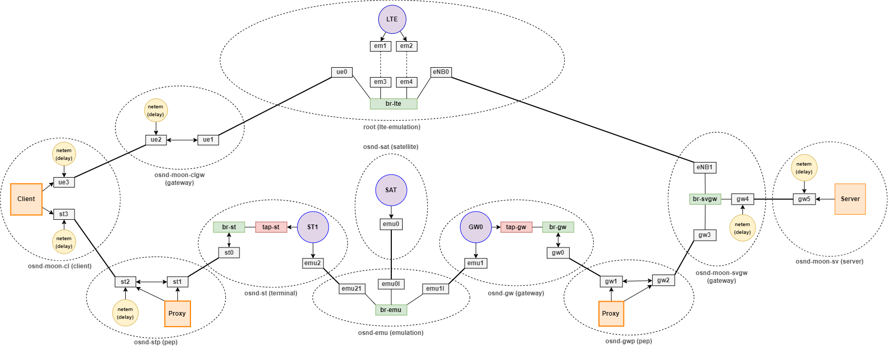

# Cellular and SATCOM Joint Emulator

The scripts are built on the [OpenSAND](https://opensand.org/content/home.php) satellite and [MoonGen](https://github.com/brentondwalker/MoonGen/) cellular emulation platforms. They offer a possibility to run automated measurements of various transport and application layer network protocols. The Cellular and SATCOM joint emulator is based on the [fork](https://github.com/curtp67/quic-opensand-emulation) from the [quic-opensand-emulation](https://github.com/moonlight200/quic-opensand-evaluation) repo.

Each emulation (one execution of the `execute-measurements.sh` script) consist of multiple
scenarios that are tested, each of which has a different configuration (such as
the orbit of the emulated satellite). Within a single scenario multiple measurements
are executed to measure the performance of different protocols. Each measurement is
executed multiple times with each execution being called a run. This will generate
more statistically stable results.

[](res/network-namespace-satcom-cellular.pdf)

This is an overview of the environment that is created by the scripts using network namespaces.

### Measured performance values

While the complete output of each component taking part in a measurement is captured,
the runs aim to measure the following set of performance values:

* Goodput Evolution
* Congestion Window Evolution
* Connection Establishment Time
* Time to First Byte

For evaluation of the result you can use these scripts: [quic-opensand-evaluation](https://github.com/curtp67/quic-opensand-evaluation)

### Script structure

The main executable script is `execute-measurements.sh` it will source all other scripts before
starting the measurements. Some scripts (such as `setup.sh` and `teardown.sh`) can
also be executed individually for e.g. manual measurements.

* `execute-measurements.sh` - Main executable
* `setup*.sh` - Environment creation and setup
* `teardown*.sh` - Environment disassembly
* `run*.sh` - Execution of the individual measurement runs

# Installation

1. Ensure the requirements below are met
2. Copy all files (including subdirectories) to the machine that will run the emulation
3. Update configuration, especially the file and directory paths

### Requirements

These programs need to be cloned and built

* [qperf](https://gitlab.lrz.de/kosekmike/qperf)
* [pepsal](https://github.com/danielinux/pepsal)
* [moongen](https://gitlab.lrz.de/ge36xuy/moongen-lte-emulator)
* [GStreamer](https://github.com/GStreamer/gstreamer)

The following utilities need to be installed on the system:

* [opensand](https://opensand.org/content/get.php) (which installs `opensand-core`, `opensand-network` and `opensand-daemon`)  
  Not required are `opensand-collector` and `opensand-manager`
* iperf3
* tmux
* curl
* nginx (deamon can be disabled, is only used standalone)
* iproute2
* xmlstarlet

# Usage

Executing the main script `execute-measurements.sh` will start the automated emulation. As this
will take some time, it is recommended to start the script in a tmux session.
```bash
tmux new-session
./execute-measurements.sh
```
This allows to detach from the process and re-attach at any time later.

The results of an emulation can be found in a subdirectory of the configured
`RESULTS_DIR` (default `out`), along with the emulation log file. To simplify
downloading the results, the symlink `latest` in `RESULTS_DIR` is updated to the
latest emulation output directory. When downloading the results, it is
recommended to use `rsync` over `scp` since the output consists of many small
files.

The script can be interrupted at any point, which will stop the current emulation
and cleanup the environment.

## Parameters

### General parameters 

| Name | Argument | Description |
| ---- | -------- | --- |
| `-f` | `<file>` | Read the scenario configuration from the file instead of the commandline arguments |
| `-h` |          | Print a help message and exit |
| `-s` |          | Show the system statistics also in the log printed to stdout |
| `-t` | `<tag>`  | A tag to append to the output directory name, used for easier identification |
| `-v` |          | Print version and exit |

### Scenario configuration

These parameters configure the scenarios that are executed. All combinations of
all configured values are executed. Environment parameters (Type E) control the
circumstance in which the measurements are performed. Transport parameters (Type T)
affect the protocols that are measured. The combination of values for E and T parameters
create a scenario. Measurement parameters (Type M) apply to all scenarios. The joint testbed parameters (Type J) apply to the control the orchestration of the joint testbed.

E.g. if orbits `-O GEO,MEO` (Type E), congestion controls `-C rrrr,cccc` (Type T)
and goodput measurements `-N 5` (Type M) are configured, four different scenarios are
executed, each being measured 5 times.

| Name | Argument   | Description | Default | Type |
| ---- | ---------- | --- | --- | --- |
| `-A` | `<#,>`     | Comma separated list of attenuation values to measure | `0` | E |
| `-b` | `<#,>`     | Generated iPerf bandwith vis-à-vis the defined QoS requirements \[UL,DL\] | `20M,5M` | T |
| `-B` | `<GT,>*`   | `QUIC-specific:` Comma separated list of two qperf transfer buffer sizes for gateway and terminal. Repeat parameter for multiple configurations | `1M,1M` | T |
| `-c` | `<#,>`     | `MPTCP-specific:` congestion control, uncoupled \[cubic\|reno\], coupled \[lia\|olia\|wVegas\|balia\]; <br/> `MPDCCP-specific:` congestion control ID (CCID) \[2\|5\];<br/> Overrides single-path CC at end hosts (-C) option | `lia`<br/>`2` | T |
| `-C` | `<SGTC,>`  | Comma separated list of four congestion control algorithms for server, gateway, terminal and client. \[c = cubic, r = reno\] | `rrrr` | T |
| `-d` |            | Disable duplex measurements | | M |
| `-D` | `#`        | dump the first # packets of a measurement | | M |
| `-e` | `<#,>`     | `MPDCCP-specific:` reordering engine \[default\|fixed\] | `default` | T |
| `-E` | `<GT,>`    | csl of two delay values: each one value or multiple seconds-delay values | `125` | M |
| `-F` | `<#,>*`    | `QUIC-specific:` csl of three values: max. ACK Delay, packet no. after which first ack frequency packet is sent, fraction of CWND to be used in ACK frequency frame | `25, 1000, 8` | T |
| `-g` | `<#,>`     | csl of ground delays at the client and the server \[CL_SAT,CL_LTE,SV\] | `0,0,0` | M |
| `-H` |            | Disable HTTP measurements | | M | 
| `-i` |            | Disable iperf duplex measurements | | M |
| `-j` |            | Disable dccp duplex measurements | | M |
| `-I` | `<#,>*`    | csl of four initial window sizes for SGTC | `10` | T |
| `-l` | `<#,>`     | `QUIC-specific:` csl of two file paths for qlog file output: client, server | `server.qlog und client.qlog in output directory` | T |
| `-L` | `<#,>`     | percentages of packets to be dropped | `0` | M |
| `-m` | `<#,>`     | Multipath protcol \[MPTCP\|MPDCCP\] | `MPTCP` | M |
| `-N` | `#`        | Number of runs per goodput measurement in a scenario | `1` | M |
| `-o` |            | Enable rtp-over-quic (ROQ) video logging at end-hosts | | M |
| `-O` | `<#,>`     | Comma separated list of orbits to measure \[GEO\|MEO\|LEO\] | `GEO` | E |
| `-p` | `<#,>`     | `MPTCP-specific:` advanced path-manager control \[default\|fullmesh\|ndiffports\|binder\|netlink\];<br/> `MPDCCP-specific:` path-manager \[default\] | `fullmesh`<br/>`default` | T |
| `-P` | `#`        | Number of seconds to prime a new environment with some pings | `5` | M |
| `-Q` | `<SGTC,>*` | `QUIC-specific:` Comma separated list of four qperf quicly buffer sizes at server, gateway, terminal and client. Repeat parameter for multiple configurations | `1M,1M,1M,1M` | T |
| `-r` | `<#,>`     | `Joint Emulator-specific:` Select a routing strategy \[LTE\|SAT\|MP\] | `LTE`| J |
| `-R` |            | Disable rtp measurements | | M |
| `-S` | `<#,>`     | `MPTCP-specific:` scheduler \[default\|roundrobin\|redundant\|blest\];<br/> `MPDCCP-specific:` scheduler \[default\|srtt\|rr\|redundant\|otias\|cpf\|handover\] | `default`<br/>`srtt` | T |
| `-T` | `#`        | Number of runs per timing measurement in a scenario | `4` | M |
| `-U` | `<SGTC,>*` | `QUIC-specific:` Comma separated list of four qperf udp buffer sizes at server, gateway, terminal and client. Repeat parameter for multiple configurations | `1M,1M,1M,1M` | T |
| `-V` |            | Disable plain (non pep) measurements | | M |
| `-W` |            | Disable pep measurements | | M |
| `-X` |            | Disable ping measurements | | M |
| `-Y` |            | Disable quic measurements | | M |
| `-Z` |            | Disable tcp measurements | | M |

The command line arguments are used to generate a temporary scenario configuration
file in the emulations temporary directory (`/tmp/opensand-moongen.*/`).

## Scenario file format

The scenario file allows a much more fine-grained control over the individual
scenarios that are executed. While in the example for the command line arguments
all four combinations of orbits and congestion control algorithms form the four
scenarios, the scenario file allows executing only some of them.

Each line in the file describes a single scenario. Blank lines and lines starting
with `#` are ignored. For each scenario the exact same arguments and syntax are
used as for the scenario configuration command line arguments with the exception,
that only a single scenario must be described. Repeatable arguments must only be
given once. Arguments that define different configuration values via comma separated
lists must only have a single value.

### Example file

```
# Example scenario configuration

-N 5 -O GEO -C rrrr -Q 1M,2M,3M,4M
-N 3 -O MEO -C cccc -Q 1M,2M,3M,4M
-O GEO -C cccc -Q 1M,2M,3M,4M
```
This file describes three scenarios with varying orbits, congestion control algorithms
and goodput measurement runs. All parameters that are not given use the default value,
thus the last scenario would be executed with one run per goodput measurement.

It is `strongly recommended` to use the scenario configuration file for the joint emulation.

## Copyright

Copyright (C) 2023 Kaushik Chavali.

This code is licensed under GNU General Public License v3.0. For further information, please refer to [LICENSE](LICENSE)