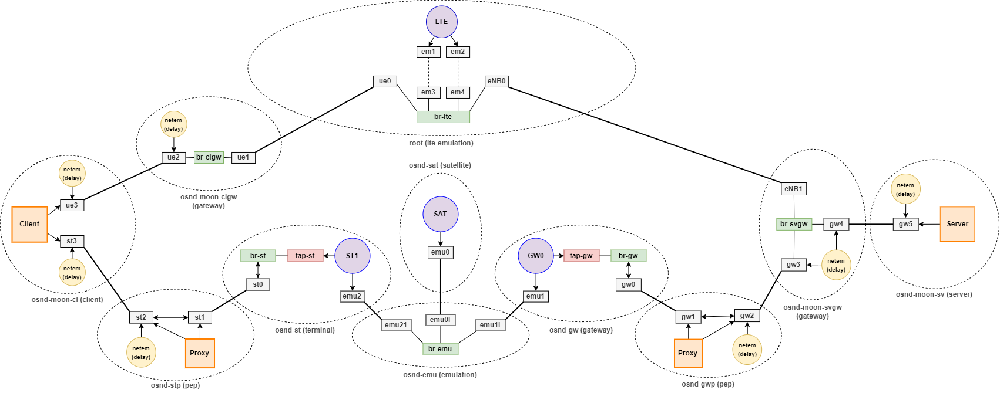

# LTE and SATCOM Joint Emulator

The scripts are built on the [OpenSAND](https://opensand.org/content/home.php) satellite emulation and [MoonGen](https://github.com/brentondwalker/MoonGen/) LTE emulation platforms. They offer a possibility to run automated measurements of various transport and application layer protocols.

This is an overview of the environment that is create by the scripts using network namespaces.